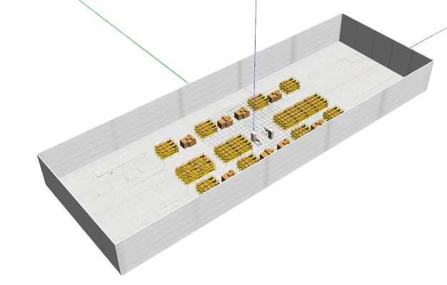
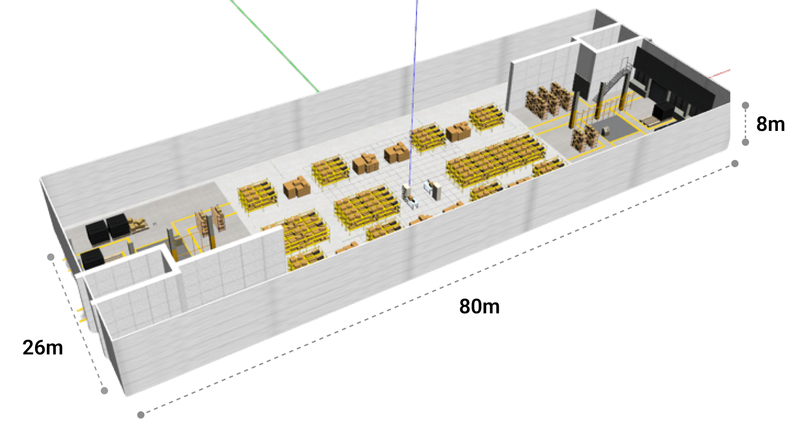
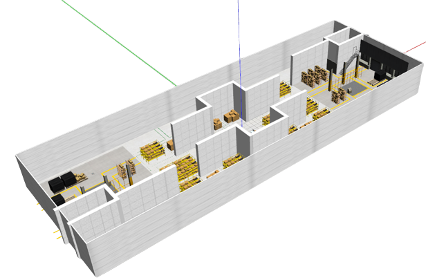

# gazebo_worlds

This package contain a Warehouse model with several levels of difficulty suitable for indoor exploration tests. The approximate size of the environment is 80x26x8 as shown in the figure below

**testbed_large_empty.world** 

 

**testbed_large.world** 

 

**testbed_large_lv1.world** 

 


## Running the simulation with the new world

If using the [MRS System](https://github.com/ctu-mrs/mrs_uav_system) is used, Please modify the gazebo window in the session_horus.yml as shown below.

```bash
-waitForRos; roslaunch /home/$(whoami)/user_ros_workspace/src/usa_gazebo_simulation/launch/simulation_horus.launch world_name:=testbed_large gui:=true
```

